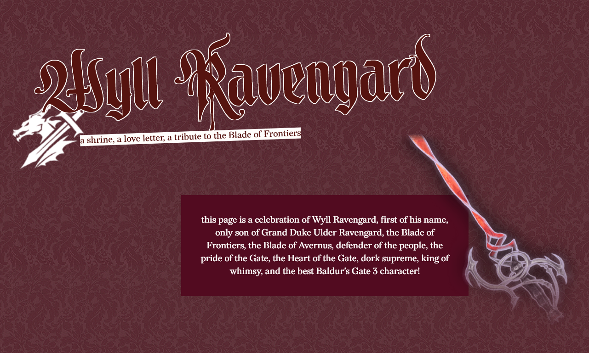
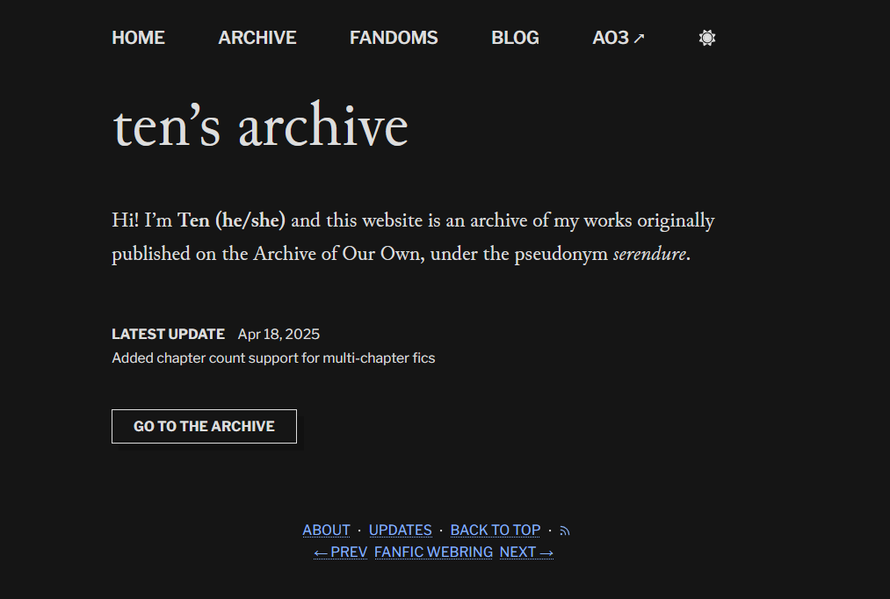

## pages
### characters
my original characters! none of these are ready though

[ [ajax](#) ] <mark class="warning">BG3</mark>
[ [jude](/characters/jude) ] <mark class="warning">D&D</mark> <mark>WIP</mark>
[ [tane](#) ] <mark class="warning">PWotR</mark>

### shrines

a shrine dedicated to my favourite *baldur’s gate 3* character, wyll ravengard

[ [wyll shrine](/shrines/wyll) ] <mark class="warning">spoilers</mark>

## websites
### fic archive

a personal archive of fics i’ve written and published on AO3

[ [the archive](https://serendure.neocities.org/) ] <mark class="error">18+</mark>

## ao3 stuff

### 11ty starter

wanna make your own fic archive? i made a starter project! there’s no readme or demo page atm but there’s a (verbose) guide page in the source code. 

[ [github](https://github.com/tencurse/ao3-11ty-starter) ] <mark>WIP</mark>

### only show primary pairing

a userscript to automatically hide ao3 works that don’t have your currently selected pairing/character in the first `n` number of tags

[ [greasyfork](https://greasyfork.org/en/scripts/484106-ao3-only-show-primary-pairing-auto) ]
